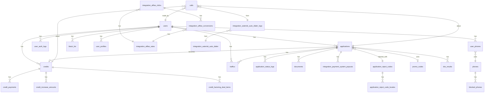

# Database Schema

_Last updated: 2026-08-25_
_Tables documented: 27 (поповнюється по мірі надходження SQL)_

---

## Business Context

**Тип компанії:** МФО (мікрофінансова організація)
**Продукти:** кредити, заявки
**Скор-бал:** від 120 до 300
**Кредитні бюро:** УБКІ, АППЛ — тири 1–7

---

## Company IDs (brand_id у БД)

| Company | brand_id | Notes |
|---------|----------|-------|
| **ЄГроші** | **2** | ✅ активний |
| **Фінмаркет (ФМ)** | **13** | ✅ активний |
| **Топ1** | **14** | ✅ активний |
| Неактивні бренди | 5, 8, 9, 17, 18, інші | ❌ більше не використовуються, але є в БД (історичні дані). brand_id=5 зустрічається у перевірці вторички через credits.extra_user_id |

---

## Tables

| Table | Description | Key Columns | Related Tables |
|-------|-------------|-------------|----------------|
| **users** | Реєстрації клієнтів | id, created_at, brand_id | applications, traffics |
| **applications** | Заявки на кредит | id, status, brand_id, amount, user_id, is_current_client, promo_code_id | users, credits, traffics, promo_codes |
| **credits** | Кредити (після видачі) | id, brand_id, application_id, extra_user_id, status, created_at, closed_at | applications, credit_payments, credit_increase_amounts |
| **credit_payments** | Платежі по кредитах (збори) | credit_id, payed_at, amount, type | credits |
| **credit_increase_amounts** | Добори до кредитів | credit_id, amount, status, created_at | credits |
| **traffics** | Трафікові мітки (UTM) | id, application_id, user_id, type, utm_medium | applications, users |
| **application_status_logs** | Лог змін статусів заявок | application_id, to_status | applications |
| **integration_payment_system_payouts** | Фактичні виплати клієнтам | application_id, processed_at | applications |
| promo_codes | Промо-коди | id, promo_id | promos, applications |
| promos | Промо-кампанії | id | promo_codes |
| **documents** | Документи підпису кредитних угод | id, application_id, is_signed_by_sms, user_sign_data_source | applications, credit_increase_amounts |
| **application_reject_code_locales** | Тексти причин відмов | id, text | applications |
| **dss_results** | Результати DSS-скорингу | id, application_id | applications, dss_group_results |
| **dss_group_results** | Групові результати DSS | id, dss_result_id | dss_results, dss_group_rule_results |
| **dss_group_rule_results** | Результати правил DSS | id, dss_group_result_id, messages (jsonb) | dss_group_results, dss_group_rules |
| **dss_group_rules** | Правила DSS | id, code | dss_group_rule_results |
| **calls** | Дзвінки КЦ та автодайлера | id, created_at, user_id, admin_id, application_id, credit_id, phone_id, type, status, duration, real_duration, is_manual_dialer, integration_asterisk_auto_dialer_log_id | users, applications, credits |
| **integration_asterisk_auto_dialer** | Кампейни автодайлера | id, created_at, brand_id, name, type, is_active, config, params, url | integration_asterisk_auto_dialer_logs |
| **integration_asterisk_auto_dialer_logs** | Батч-завантаження номерів в автодайлер | id, created_at, integration_asterisk_auto_dialer_id, url, request (jsonb), response (jsonb) | integration_asterisk_auto_dialer, calls |
| **application_reject_codes** | Довідник кодів відмов + параметри блоку повторної подачі | id, brand_id, code, block_type, block_interval | applications, application_reject_code_locales |
| **user_auth_logs** | Логи входів у ЛК | id, user_id, created_at, os, source | users |
| **user_phones** | Зв'язка юзер↔телефон | user_id, phone_id, is_verified, is_login | users, phones, blocked_phones |
| **phones** | Номери телефонів | id, domain, value | user_phones, blocked_phones |
| **blocked_phones** | Блокування телефонів для SMS | phone_id, is_blocked_sms, brand_id | phones |
| **black_list** | Чорний список юзерів | user_id, is_active | users |
| **integration_affise_clicks** | Кліки Affise (маркетинг) | id, brand_id, ip, sub1, sub2, partner_id, affise_created_at | integration_affise_conversions, integration_affise_rates |
| **integration_affise_conversions** | Конверсії Affise (маркетинг) | id, brand_id, application_id (⚠️завжди NULL), partner_id, offer_title | integration_affise_clicks, integration_affise_rates |
| **integration_affise_rates** | Ставки + назви партнерів Affise | date_from, date_to, partner_id, rate, name, brand_id | integration_affise_clicks, integration_affise_conversions |
| **credit_factoring_deal_items** | Кредити передані у факторинг | old_credit_id | credits |

---

## Known Relationships
- `users.id` → `applications.user_id`
- `users.id` → `traffics.user_id`
- `applications.promo_code_id` → `promo_codes.id` → `promo_codes.promo_id` → `promos.id`
- `applications.id` → `integration_payment_system_payouts.application_id`
- `applications.id` → `credits.application_id` ✅
- `credits.extra_user_id` → `users.id` (для перевірки вторички!)
- `credits.id` → `credit_increase_amounts.credit_id`
- `credits.id` → `credit_payments.credit_id`
- `applications.id` → `application_status_logs.application_id`
- `applications.id` → `traffics.application_id`
- `applications.id` → `documents.application_id`
- `documents.id` → `credit_increase_amounts.document_id`
- `applications.application_reject_code_id` → `application_reject_code_locales.id`
- `dss_results.application_id` → `applications.id`
- `dss_group_results.dss_result_id` → `dss_results.id`
- `dss_group_rule_results.dss_group_result_id` → `dss_group_results.id`
- `dss_group_rule_results.dss_group_rule_id` → `dss_group_rules.id`
- `calls.user_id` → `users.id`
- `calls.application_id` → `applications.id`
- `calls.credit_id` → `credits.id`
- `calls.phone_id` → `user_phones.phone_id` (основний джойн для КЦ, більшість calls.user_id = NULL)
- `calls.integration_asterisk_auto_dialer_log_id` → `integration_asterisk_auto_dialer_logs.id`
- `integration_asterisk_auto_dialer_logs.integration_asterisk_auto_dialer_id` → `integration_asterisk_auto_dialer.id`
- `applications.application_reject_code_id` → `application_reject_codes.id` ✅ ПІДТВЕРДЖЕНО
- `application_reject_codes.id` → `application_reject_code_locales.application_reject_code_id` (текст причини)
- `traffics.application_id` → `traffics.webmaster` ⭐ **прямий зв'язок заявка↔партнер** (правильний спосіб атрибуції, всі бренди)
- `user_auth_logs.user_id` → `users.id`
- `user_phones.user_id` → `users.id`, `user_phones.phone_id` → `phones.id`
- `blocked_phones.phone_id` → `phones.id`
- `black_list.user_id` → `users.id`
- `credit_factoring_deal_items.old_credit_id` → `credits.id`
- `integration_affise_clicks.id` → `integration_affise_conversions.integration_affise_click_id`
- `integration_affise_conversions.application_id` → `applications.id` ⚠️ **НЕ ПРАЦЮЄ** (поле завжди NULL для brand_id=14, перевірено) — не використовувати для атрибуції партнера
- `integration_affise_clicks/conversions.partner_id` + `brand_id` → `integration_affise_rates.partner_id` + `brand_id` (назва партнера)

## Схема (ER-діаграма)



**Атрибуція партнера:** `traffics.application_id` → `traffics.webmaster` — прямий зв'язок заявка↔партнер (детальніше в `tables/traffics.md`).

_Якщо mermaid не рендериться у VS Code preview — переконайся що ввімкнена ВБУДОВАНА підтримка (VS Code 1.121+), а стара окрема розширення вимкнена/видалена, щоб уникнути конфлікту._

## Воронка клієнта (повна)
```
users (реєстрація)
  → applications (подача, status: 1→2→5→6 або →3/4)
    → credits (видача, коли application.status=6)
      → credit_payments (збори/платежі)
      → credit_increase_amounts (добори)
```

## Ключові формули
- **Видача** = `SUM(applications.amount WHERE status=6)` + `SUM(credit_increase_amounts.amount WHERE status=2)`
- **Дата видачі** = `MAX(integration_payment_system_payouts.processed_at) per application`
- **Першичка (ЄГ, точна формула)** =
  - `is_current_client = false`
  - AND немає кредиту де `extra_user_id = user_id AND status IN (2,3) AND brand_id = 5`
- **Вторичка (ЄГ)** = `is_current_client = true`
  OR (`is_current_client = false` AND є кредит на brand_id=5 через extra_user_id)
- **CPA трафік** = `traffics.type=13 AND utm_medium='cpa'`
- **Збори ЄГ** = `credit_payments WHERE credits.brand_id IN (2,5,8)` ← ЄГ має 3 brand_id!
- **applications.status** = 1=нова | 2=схвалено | 3=відмова | 4=доопрацювання | 5=підписання | 6=видача
- **Скор-бал МФО** = витягується з `dss_group_rule_results.messages` (jsonb) через `dss_group_rules.code = 'R143'`, regex `'Скоринг МФО: (\d+)'`, діапазон 101–300

## Вхідний % — формула
```
income_percent = SUM(rate × amount × days) / SUM(amount × days)
```
= зважена середня **денна** відсоткова ставка по нових кредитах за день.
"Без комісії" = використовується `first_base_rate_with_promo` (знижка промо, без комісії).
Поточне значення: ~0.85–0.89% на день (серпень 2026, ЄГ).

**Metabase model #17489** (`shablon-zayavok-z-komisiyami-pri-vid`) — підзапит що містить:
`application_id`, `first_base_rate_with_promo`, `application_amount`, `original_interval`

## calls.status (автодайлер, type=2, is_manual_dialer=false)
| status | Значення |
|--------|----------|
| 2 | Відповів (жива розмова, avg 27 сек) → "відповіджено" |
| 4 | Переведено на оператора (status=2 AND admin_id IS NOT NULL точніше) |
| 5 | Не підняв трубку (duration 0-1) |
| 3 | Зайнято / відбій |
| 6 | Технічний збій (duration=0) |
| 8 | Автовідповідач (duration 0-15) |
| 7 | Перевантаженість мережі |
| 1 | В процесі набору |

**Увага:** "переведено на КЦ" = `status=2 AND admin_id IS NOT NULL` (не status=4!)
**Увага:** `real_duration` — реальна тривалість розмови (відрізняється від `duration`)

## integration_asterisk_auto_dialer_logs.request (JSON структура)
```json
{
  "call_list": [{"phone": "+380...", "credit_id": 123, "first_name": "...", "third_name": "..."}],
  "identifier": "7",
  "department_key": "autorobot_tm",
  "integration_asterisk_auto_dialer_log_id": 1
}
```
- `department_key = 'autorobot_tm'` → КЦ вигрузки (відфільтровує від маркетингових)
- `identifier` → тип лінії: ЄГ(2): 7=перв, 4=втор, 6=акцепт, 5=доробота; ФМ(13): 35=перв, 48=втор, 37=акцепт, 36=доробота

## Unclear / To Investigate
- [x] ЄГроші brand_id 5 — суб-бренд, перевіряється через credits.extra_user_id для визначення вторички
- [ ] ЄГроші brand_id 8 — призначення уточнити
- [ ] BrandEnum — підтвердити ФМ=13, ТОП1=14
- [x] promos.id = 41799 — внутрішній/тестовий промо, виключається з аналітики видачі завжди: `AND (promos.id != 41799 OR promos.id IS NULL)`
- [x] Повні статуси credits.status — ✅ **1 і 3 = відкритий, 2 = закритий** (перевірено 2026-08-25, попередній запис "2=активний,3=закритий" був невірним, виправлено)
- [x] Атрибуція заявки до партнера — ✅ через `traffics.webmaster` (не через affise/IP)
- [x] Таблиця кодів відмов — ✅ `application_reject_codes`, `block_interval` у хвилинах
- [ ] Як зберігається скор-бал УБКІ/АППЛ
- [ ] credit_payments.type — які ще типи крім 1?
- [ ] Чи існує версія вхідного % "з комісією" (first_base_rate_with_commission)?
- [ ] `collection_plan` — таблиця плану (поля: body=план, date, admin_id). admin_id=25 — чийсь план. Уточнити структуру.
- [ ] Чи `traffics.webmaster` id — спільний довідник для всіх брендів, чи специфічний для кожного (списки для ЄГ і ТОП1 майже співпадають, але не перевірено напевно)
- [ ] Повна структура `traffics` — відомі лише `application_id`, `user_id`, `type`, `utm_medium`, `webmaster`
- [ ] Реальний текст (`application_reject_code_locales.text`) для конкретних кодів відмов — жодного разу не витягували фактичний зміст, лише код-число (напр. код 12 для ТОП1)
